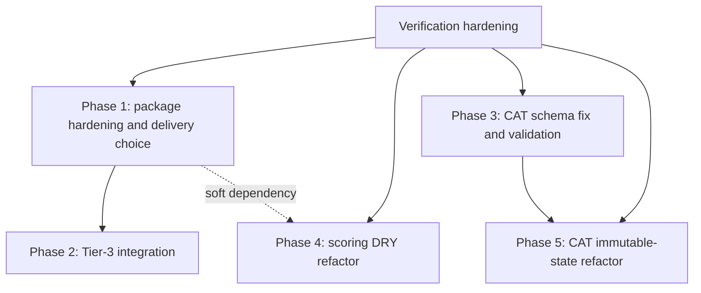

# Technical Assessment: CAT, Scoring, Package Linking, and Phase Dependencies

Date: 2026-03-20

Scope:
- `web/src/scoring/*`
- `web/src/components/AdaptiveTestRunner.tsx`
- `web/src/instruments/*`
- `web/public/item-banks/*`
- `web/package.json`
- `docs/PSYCHE-WEB-NEXTJS-DELIVERY-MATRIX.md`
- `docs/reviews/iteration-1/*`

Verification baseline:
- `pnpm test` in [`web/package.json`](../web/package.json) passes: 49 tests across 6 files.
- That passing suite does not cover the production JSON CAT asset path, `scoreBinary`, or any package-export / packaging contract.

## 1. Schema Mismatch Risk Assessment

Risk rating: High

### Finding

The CAT runtime expects `GRMItem.id` and `GRMItem.text`, but the shipped banks use `itemId` and `itemText`. The load boundary trusts the JSON as `GRMItem[]` without adapting or validating it.

### Primary evidence

[`web/src/scoring/grm-engine.ts:14-29`](../web/src/scoring/grm-engine.ts#L14)
```ts
export interface GRMItem {
  id: string;
  text: string;
  discrimination: number;
  thresholds: number[];
  numCategories: number;
  dimensionId: string;
  reverse?: boolean;
}
```

[`web/public/item-banks/big5-grm-params.json:2-15`](../web/public/item-banks/big5-grm-params.json#L2)
```json
{
  "itemId": "CAT-N1-001",
  "itemText": "[Anxiety item 1]",
  "dimensionId": "N1",
  "reverse": false,
  "discrimination": 1.4394,
  "thresholds": [0.1255, 0.4255, 0.7921, 1.6101],
  "numCategories": 5
}
```

[`web/src/components/AdaptiveTestRunner.tsx:63-70`](../web/src/components/AdaptiveTestRunner.tsx#L63)
```ts
fetch(itemBankUrl)
  .then((r) => {
    if (!r.ok) throw new Error(`Failed to load item bank: ${r.status}`);
    return r.json();
  })
  .then((data: GRMItem[]) => {
    setItemBank(data);
```

[`web/src/scoring/cat-controller.ts:217-226`](../web/src/scoring/cat-controller.ts#L217)
```ts
const item = itemBank.find((i) => i.id === itemId);
if (!item) return;

const response: CATResponse = { itemId, category };
dimSession.administered.push(response);
dimSession.administeredIds.add(itemId);
```

[`web/src/components/TestItemDisplay.tsx:47-49`](../web/src/components/TestItemDisplay.tsx#L47)
```tsx
<p style={{ fontSize: "1.5rem", fontWeight: 500, margin: "1rem 0 2rem" }}>
  {text}
</p>
```

### Root cause

The generator and shipped banks are authored with transport keys:

[`analysis/scripts/generate_synthetic_banks.py:56-65`](../analysis/scripts/generate_synthetic_banks.py#L56)
```py
return {
    "itemId": f"CAT-{facet_id}-{item_num:03d}",
    "itemText": f"[{facet_name} item {item_num}]",
    "dimensionId": facet_id,
    "dimensionName": facet_name,
    "reverse": reverse,
```

The runtime type and controller logic are authored against application keys (`id`, `text`), and the fetch boundary performs no schema normalization.

### Runtime impact

1. Blank prompts

[`web/src/components/AdaptiveTestRunner.tsx:214-222`](../web/src/components/AdaptiveTestRunner.tsx#L214)
```tsx
<TestItemDisplay
  text={currentItem.item.text}
  responseType="likert"
```

Because `currentItem.item.text` is actually `undefined`, the prompt body renders blank.

2. Undefined item IDs in responses

[`web/src/components/AdaptiveTestRunner.tsx:109-115`](../web/src/components/AdaptiveTestRunner.tsx#L109)
```ts
registerResponse(
  sessionRef.current,
  itemBank,
  currentItem.item.id,
  category,
```

`currentItem.item.id` is `undefined`, so the response path records `itemId: undefined`.

3. Administered-item tracking collapses

[`web/src/scoring/grm-engine.ts:259-266`](../web/src/scoring/grm-engine.ts#L259)
```ts
for (const item of bank) {
  if (administered.has(item.id)) continue;
  const info = itemInformation(item, theta);
```

Once `undefined` is inserted into `administeredIds`, every item in that dimension appears already administered because every `item.id` is also `undefined`.

4. Wrong-dimension routing and theta corruption

[`web/src/scoring/grm-engine.ts:178-195`](../web/src/scoring/grm-engine.ts#L178)
```ts
for (const r of responses) {
  responseMap.set(r.itemId, r.category);
}
...
const cat = responseMap.get(item.id);
```

All responses collapse onto the same `undefined` key. That makes theta estimation operate on a corrupted response map, not on item-specific answers.

### Why this is marked non-functional

This is not only a psychometric-validity issue. It breaks basic runtime behavior:
- the user does not see item text,
- the response identifier is missing,
- administered-item deduplication no longer works,
- dimension routing can jump incorrectly because `registerResponse()` resolves the first `undefined` ID match.

That is why this should be classified as non-functional, not merely "low-quality CAT."

### Remediation paths

| Path | Change | Benefits | Risks | Risk rating |
| --- | --- | --- | --- | --- |
| Normalize JSON at source | Rename shipped keys to `id` / `text` in the generator and committed banks | One runtime shape, simpler types, fewer adapters, failures caught earlier in every consumer | Breaks any existing consumer or script that expects `itemId` / `itemText`; requires regenerating both banks and updating related tooling/docs | Medium |
| Add adapter at load boundary | Map raw bank records to `GRMItem` inside `AdaptiveTestRunner` or a dedicated loader, with runtime validation | Small blast radius, backwards compatible with existing JSON, quickest path to a working CAT runtime | Two schemas continue to exist; any consumer that bypasses the adapter can reintroduce the bug | Low-Medium |

Recommended mitigation:
- Short term: add a load-time adapter plus runtime validation.
- Medium term: normalize the bank format at source once all consumers are identified.
- Add an integration test that loads the actual JSON asset and asserts first item text and ID are defined.

## 2. Scoring DRY Refactor Risk

Risk rating: Medium-High

### Actual behavioral differences

[`web/src/scoring/engine.ts:31-34`](../web/src/scoring/engine.ts#L31)
```ts
let value = resp.value;
if (item.reversed) {
  value = 1 - value;
}
```

[`web/src/scoring/engine.ts:84-88`](../web/src/scoring/engine.ts#L84)
```ts
let value = resp.value;
if (item.reversed && item.response.type === "likert") {
  const { min, max } = item.response;
  value = max + min - value;
}
```

[`web/src/scoring/engine.ts:46-47`](../web/src/scoring/engine.ts#L46)
```ts
const raw = items.reduce((sum, i) => sum + i.value, 0) / items.length;
const normalized = raw * 100;
```

[`web/src/scoring/engine.ts:105-114`](../web/src/scoring/engine.ts#L105)
```ts
if (firstItem?.response.type === "likert") {
  const { min, max } = firstItem.response;
  if (max === min) {
    normalized = raw === min ? 0 : 100;
  } else {
    normalized = ((raw - min) / (max - min)) * 100;
  }
}
normalized = Math.max(0, Math.min(100, normalized));
```

### Difference map

| Concern | `scoreBinary` | `scoreLikert` | Refactor risk |
| --- | --- | --- | --- |
| Reversal gate | Unconditional on `item.reversed` | Conditional on `item.reversed && item.response.type === "likert"` | A shared helper can easily apply the wrong reversal rule to the wrong response type |
| Reversal formula | `1 - value` | `max + min - value` | Binary is domain-specific to 0/1 values; Likert depends on per-item range |
| Normalization | `raw * 100` | Range-based normalization | A common helper can accidentally treat binary as 1-5 Likert or clamp it differently |
| Clamping | None | Clamps to `[0, 100]` | Centralizing normalization can silently change current binary outputs |
| `min === max` handling | None | Explicit branch to `0` or `100` | A shared abstraction can erase or misapply this edge-case behavior |

### Why the existing binary behavior is intentionally narrower

Binary responses are generated as `1` for the first label and `0` for the second label, not as a generic 2-point Likert:

[`web/src/components/TestRunner.tsx:279-281`](../web/src/components/TestRunner.tsx#L279)
```ts
const btnValue = idx === 0 ? 1 : 0;
const isSelected = existingResponse?.value === btnValue;
```

[`web/src/instruments/self-monitoring-18.ts:63-66`](../web/src/instruments/self-monitoring-18.ts#L63)
```ts
// keyedTrue=false means False=0 is the "high SM" answer
// (reverse so True→0, False→1)
reversed: !item.keyedTrue,
```

That means `1 - value` is not just a stylistic shortcut. It is coupled to the concrete 0/1 encoding used by the UI and the instrument definitions.

### Test coverage gaps

[`web/tests/scoring.test.ts:1-97`](../web/tests/scoring.test.ts#L1) exercises only `scoreLikert`, and only three cases:
- mean calculation,
- reverse scoring,
- missing responses.

There is no `scoreBinary` coverage:

[`docs/reviews/iteration-1/opus-review.md:304-314`](../docs/reviews/iteration-1/opus-review.md#L304)

There is also no test coverage for:
- `NaN` values: `typeof NaN === "number"`, so both scorers currently accept it and can emit `NaN` outputs.
- `undefined` or non-number values inside `responses`: both scorers skip them, but that skip behavior is not asserted.
- zero valid responses for a scale: both scorers currently omit the scale entirely, but that behavior is not asserted.
- the `min === max` branch in `scoreLikert`.
- binary normalization/clamping boundaries.

### Why a shared helper is risky

The duplicated code is real, but the behavioral surface is not identical. Extracting a single `scoreGeneric()` too early creates a risk of mixing policies that are currently distinct:
- accidental clamping of binary scores,
- accidental unconditional reversal for non-Likert items,
- accidental reuse of `firstItem.response.min/max` on binary items,
- accidental standardization of the zero-valid-response case.

Recommended mitigation:
- First add coverage for current behavior, including edge cases and one binary instrument fixture.
- If refactoring, only extract the shared plumbing:
  - response-map construction,
  - scale bucketing,
  - `InstrumentResult` assembly.
- Keep reversal and normalization as separate wrapper-owned functions with explicit tests.

## 3. Tier-3 Linking Complexity

Risk rating: High for committed `link:` delivery, Low for published npm, Medium for tarball

Important scope note:
- The `tier-3-nextjs` consumer repo is not present here.
- The blocker analysis below is grounded in this repo's package metadata and in [`docs/PSYCHE-WEB-NEXTJS-DELIVERY-MATRIX.md`](../docs/PSYCHE-WEB-NEXTJS-DELIVERY-MATRIX.md), which documents the intended integration contract.

### Blocker 1: `link:` is CI- and Vercel-incompatible as a committed dependency

[`docs/PSYCHE-WEB-NEXTJS-DELIVERY-MATRIX.md:5-9`](../docs/PSYCHE-WEB-NEXTJS-DELIVERY-MATRIX.md#L5)

[`docs/PSYCHE-WEB-NEXTJS-DELIVERY-MATRIX.md:142-147`](../docs/PSYCHE-WEB-NEXTJS-DELIVERY-MATRIX.md#L142)
```md
- Vercel or other isolated CI runners cannot resolve `../../../psyche/web`.
- The symlink exists locally but points outside the checked-out repo on another machine.
- Syncthing copies partial changes into `psyche/web`, causing transient type/build failures.
```

Assessment:
- If Phase 1 means "commit `link:../../../psyche/web` as the production dependency," the plan is blocked.
- If Phase 1 means "use `link:` locally as a dev override while production stays on npm/tarball," it is viable.

### Blocker 2: Missing `psyche-web` export for `./open-ended`

[`web/package.json:6-13`](../web/package.json#L6)
```json
"exports": {
  "./types": "./src/instruments/types.ts",
  "./registry": "./src/instruments/registry.ts",
  "./tiers": "./src/instruments/tiers.ts",
  "./scoring": "./src/scoring/engine.ts",
  "./init-lite": "./src/instruments/init-lite.ts",
  "./init-standard": "./src/instruments/init-standard.ts"
}
```

[`web/src/instruments/open-ended.ts:10-21`](../web/src/instruments/open-ended.ts#L10)
```ts
export const INTERVIEW_PROMPTS = [
  "Describe yourself as you would to a stranger who will never see you. Be as honest as possible.",
  ...
];
```

Assessment:
- The package exports the init side effects, but not the direct `open-ended` module.
- That blocks any consumer that wants to import `INTERVIEW_PROMPTS` directly to remove prompt duplication in an `InterviewFlow`-style component.
- It is not a blocker for bare registry initialization, but it is a blocker for a clean prompt-sharing contract.

Recommended mitigation:
- Add `"./open-ended": "./src/instruments/open-ended.ts"` or, better, export a narrower prompt-only module.

### Blocker 3: Next.js must transpile the package

[`docs/PSYCHE-WEB-NEXTJS-DELIVERY-MATRIX.md:15-16`](../docs/PSYCHE-WEB-NEXTJS-DELIVERY-MATRIX.md#L15)

[`docs/PSYCHE-WEB-NEXTJS-DELIVERY-MATRIX.md:28-38`](../docs/PSYCHE-WEB-NEXTJS-DELIVERY-MATRIX.md#L28)
```ts
const nextConfig: NextConfig = {
  transpilePackages: ['psyche-web'],
};
```

Assessment:
- The subpath exports point at `.ts` source files, not prebuilt JS.
- Without `transpilePackages`, the consumer build can fail even if dependency resolution works.
- This is a hard config dependency for both npm and link/tarball delivery.

### Blocker 4: Syncthing timing risk and missing `.stignore` policy in this repo

Documented operational risk:
- [`docs/PSYCHE-WEB-NEXTJS-DELIVERY-MATRIX.md:144-172`](../docs/PSYCHE-WEB-NEXTJS-DELIVERY-MATRIX.md#L144)

Repository evidence:
- No `.stignore` file is present anywhere under this repo.

Assessment:
- The delivery matrix explicitly warns about half-synced state.
- There is no checked-in exclusion policy here to reduce that risk.
- That makes link-based development more fragile across machines than the docs ideally assume.

Recommended mitigation:
- If Syncthing remains part of the workflow, commit a `.stignore` policy in the syncing repo(s) that excludes `node_modules`, build outputs, packed tarballs, and lockfile experiments.
- Prefer npm or tarball for anything that must be reproducible outside one machine.

### Delivery-mechanism decision matrix

| Mechanism | Evidence | Strengths | Primary blockers / failure modes | Delivery risk |
| --- | --- | --- | --- | --- |
| `link:../../../psyche/web` | [`docs/PSYCHE-WEB-NEXTJS-DELIVERY-MATRIX.md:83-172`](../docs/PSYCHE-WEB-NEXTJS-DELIVERY-MATRIX.md#L83) | Fastest local iteration | Fails in isolated CI/Vercel; operationally fragile with Syncthing; easy to commit accidentally | High |
| Published npm package | [`docs/PSYCHE-WEB-NEXTJS-DELIVERY-MATRIX.md:174-307`](../docs/PSYCHE-WEB-NEXTJS-DELIVERY-MATRIX.md#L174) | Reproducible, CI-safe, Vercel-safe | Currently blocked by `"private": true` and missing package hardening | Low once hardened |
| Vendored tarball | [`docs/PSYCHE-WEB-NEXTJS-DELIVERY-MATRIX.md:308-387`](../docs/PSYCHE-WEB-NEXTJS-DELIVERY-MATRIX.md#L308) | CI-safe without registry | Manual repack discipline; artifact can go stale | Medium |

Additional packaging hardening evidence:

[`web/package.json:2-4`](../web/package.json#L2)
```json
"name": "psyche-web",
"private": true,
"version": "0.1.0",
```

Recommended mitigation:
- Use npm as the committed path.
- Use `link:` only as a local developer override.
- Keep tarball as the registry-free fallback.

## 4. CAT Immutable State Complexity

Risk rating: High

This refactor is materially larger than "replace mutation with spread operators."

### 4.1 `getNextItem()` is not a pure selector

[`web/src/scoring/cat-controller.ts:166-203`](../web/src/scoring/cat-controller.ts#L166)
```ts
while (session.currentDimensionIndex < session.dimensionOrder.length) {
  const dimId = session.dimensionOrder[session.currentDimensionIndex]!;
  const dimSession = session.dimensions.get(dimId);
  if (!dimSession) {
    session.currentDimensionIndex++;
    continue;
  }
  if (dimSession.complete) {
    session.currentDimensionIndex++;
    continue;
  }
  ...
  if (dimBank.length === 0) {
    dimSession.complete = true;
    session.currentDimensionIndex++;
    continue;
  }
  ...
}
session.complete = true;
```

Despite its name, `getNextItem()` both selects an item and mutates session state:
- advances the cursor,
- marks dimensions complete,
- marks the full session complete.

An immutable rewrite therefore changes API semantics, not just syntax.

### 4.2 The state shape is nested and non-plain

[`web/src/scoring/cat-controller.ts:23-55`](../web/src/scoring/cat-controller.ts#L23)
```ts
export interface DimensionSession {
  administered: CATResponse[];
  administeredIds: Set<string>;
  complete: boolean;
  ...
}

export interface CATSession {
  dimensions: Map<string, DimensionSession>;
  dimensionOrder: string[];
  currentDimensionIndex: number;
  totalItemsAdministered: number;
  complete: boolean;
}
```

An immutable update must clone, at minimum:
- the outer `CATSession`,
- the `Map<string, DimensionSession>`,
- the targeted `DimensionSession`,
- the `administered` array,
- the `administeredIds` set.

That is more error-prone than spreading a plain object.

### 4.3 The while-loop mutates during dimension skipping

The cursor advancement logic is embedded inside the dimension-skip loop. Preserving exact behavior requires keeping these invariants aligned:
- skipped dimensions advance the cursor once,
- exhausted dimensions are marked complete before advancing,
- `session.complete` is set only after the cursor exits the loop.

An immutable refactor that separates "select" from "advance" can easily change dimension ordering or stop too early/late.

### 4.4 `registerResponse()` also depends on in-place mutation

[`web/src/scoring/cat-controller.ts:223-258`](../web/src/scoring/cat-controller.ts#L223)
```ts
dimSession.administered.push(response);
dimSession.administeredIds.add(itemId);
session.totalItemsAdministered++;
...
dimSession.theta = estimate.theta;
dimSession.se = estimate.se;
...
if (dimSession.complete) {
  session.currentDimensionIndex++;
  if ([...session.dimensions.values()].every((d) => d.complete)) {
    session.complete = true;
  }
}
```

This function mutates:
- response history,
- dedup state,
- item count,
- theta and SE,
- current-dimension cursor,
- global completion state.

The current contract is imperative. Making it immutable means redesigning the controller boundary, not merely changing the internal implementation.

### 4.5 The current consumer is intentionally imperative

[`web/src/components/AdaptiveTestRunner.tsx:56-59`](../web/src/components/AdaptiveTestRunner.tsx#L56)
```ts
const sessionRef = useRef<CATSession | null>(null);
const [currentItem, setCurrentItem] = useState<{ item: GRMItem; dimensionId: string } | null>(null);
const [progress, setProgress] = useState<ReturnType<typeof getCATProgress>>([]);
```

[`web/src/components/AdaptiveTestRunner.tsx:87-99`](../web/src/components/AdaptiveTestRunner.tsx#L87)
```ts
const session = initCATSession(...);
sessionRef.current = session;
const next = getNextItem(session, itemBank);
setCurrentItem(next);
setProgress(getCATProgress(session));
```

[`web/src/components/AdaptiveTestRunner.tsx:109-141`](../web/src/components/AdaptiveTestRunner.tsx#L109)
```ts
registerResponse(sessionRef.current, itemBank, currentItem.item.id, category, DEFAULT_STOPPING);
setTotalItems(sessionRef.current.totalItemsAdministered);
setProgress(getCATProgress(sessionRef.current));
...
const next = getNextItem(sessionRef.current, itemBank);
setCurrentItem(next);
```

The UI does not store `CATSession` in React state. It stores it in a ref and manually mirrors out derived state. An immutable controller would force a caller-contract rewrite here as well.

### Test coverage gaps

Existing CAT controller coverage:
- [`web/tests/cat-controller.test.ts:30-167`](../web/tests/cat-controller.test.ts#L30)

What is covered:
- initialization,
- first-item selection,
- max-items completion,
- basic lifecycle completion.

What is not explicitly covered:
- multi-dimension cursor progression when multiple consecutive dimensions are already complete or skipped,
- dimension exhaustion caused by administered-set state, not just `maxItems`,
- duplicate `registerResponse()` calls for the same `itemId`,
- `Map` / `Set` serialization or persistence behavior,
- exact item-order traces across a known bank,
- the production JSON asset shape.

### Why item-selection behavior is especially easy to change by accident

Selection depends on both state and transition timing:
- when `currentDimensionIndex` increments,
- when `administeredIds` is updated,
- whether `getNextItem()` pre-filters or `selectNextItem()` filters,
- whether "dimension complete" happens before or after the next selection call.

A refactor that is logically equivalent at a high level can still change:
- which dimension receives the next item,
- whether a dimension is revisited,
- how many items get administered before stopping.

Recommended mitigation:
- Add golden-trace tests that assert exact item IDs chosen over several response sequences.
- Only then consider an immutable controller, ideally as a reducer with explicit transition functions such as `applyResponse()` and `advanceCursor()`.

## 5. Phase Dependencies Analysis

Risk rating: Medium

Important scope note:
- This repo does not contain a formal numbered remediation roadmap for these five workstreams.
- The graph below is inferred from the implementation and from the packaging rollout guidance in [`docs/PSYCHE-WEB-NEXTJS-DELIVERY-MATRIX.md:395-400`](../docs/PSYCHE-WEB-NEXTJS-DELIVERY-MATRIX.md#L395).

### Inferred phases

| Phase | Scope |
| --- | --- |
| P1 | Shared package hardening and delivery decision (`link:` vs npm vs tarball) |
| P2 | Tier-3 consumer integration, including exports and `transpilePackages` wiring |
| P3 | CAT item-bank schema fix plus runtime validation |
| P4 | Scoring DRY refactor |
| P5 | CAT immutable-state refactor |
| V | Test hardening needed to verify any of the above safely |

### Directed graph



### Dependency assessment

Hard dependencies:
- P2 depends on P1.
  - Reason: consumer integration cannot be stabilized until the package delivery mechanism and export surface are defined.
- P5 depends on P3.
  - Reason: refactoring CAT state before the production bank shape is fixed makes failures ambiguous and test traces untrustworthy.

Soft dependencies:
- P4 should follow P1 if the shared-package work is meant to eliminate duplicated scoring logic across targets.
  - If P4 happens first, the refactor may need to be repeated or re-reviewed once the code is shared.

Independent tracks:
- P3 does not require P1. The standalone app can fix the CAT schema mismatch immediately.

### Is the proposed order correct?

If the intended order is:
1. shared package link,
2. scoring DRY refactor,
3. CAT schema fix,
4. CAT immutable-state refactor,

then the order is only partially correct.

Assessment:
- Correct:
  - Package extraction/hardening early makes sense if the real goal is to stop copy drift across repos.
- Incorrect:
  - The CAT schema fix should happen before any CAT immutable-state refactor.
  - The DRY scoring refactor should not precede test hardening, because current coverage is too thin to protect behavior.
  - A committed `link:` dependency is the wrong production endpoint; npm or tarball must replace it before CI/Vercel rollout.

Recommended order:
1. V: add missing regression coverage.
2. P3: fix CAT bank loading with validation.
3. P1: harden `psyche-web` and choose npm as the committed delivery path.
4. P2: integrate the consumer and add missing exports such as `./open-ended` if needed.
5. P4: refactor scoring only after golden tests exist.
6. P5: refactor CAT state last.

### Circular dependencies

No hard circular dependency is visible in the current code.

There is one easy-to-create process loop:
- "Do shared package extraction first so DRY refactor only happens once."
- "Do DRY refactor first so the shared package exports cleaner code."

That loop is avoidable by scoping P4 narrowly or deferring it until after P1/P2.

### Missed dependencies

1. Verification is the largest missing dependency.

Current gaps that can mask regressions:
- no integration test that loads `web/public/item-banks/*.json`,
- no `scoreBinary` tests,
- no `NaN` / zero-valid-response scoring tests,
- no package-export contract tests,
- no pack/publish artifact tests,
- no CAT golden-trace tests.

2. Export-surface completeness is a hidden dependency of P2.

Current evidence:
- `web/package.json` exports `./init-lite` and `./init-standard`, but not `./open-ended`.

3. CAT heavy-tier rollout has an additional quality dependency beyond schema compatibility.

[`web/src/instruments/tiers.ts:55-58`](../web/src/instruments/tiers.ts#L55)
```ts
// CAT instruments ... require validated IRT item banks before use.
// The standalone app will emit a console warning if CAT instruments are loaded
// with synthetic parameters.
```

That means "schema fixed" is not the same as "production-ready CAT."

## Recommended mitigations summary

1. Fix the CAT schema mismatch at the loader immediately, with runtime validation and an asset-backed test.
2. Do not commit `link:` as the production delivery path for `tier-3-nextjs`.
3. Add `./open-ended` or a prompt-only export before trying to remove interview prompt duplication across repos.
4. Add binary scorer and CAT golden-trace tests before any DRY or immutable-state refactor.
5. Treat the CAT immutable-state rewrite as the last step, not as cleanup.
